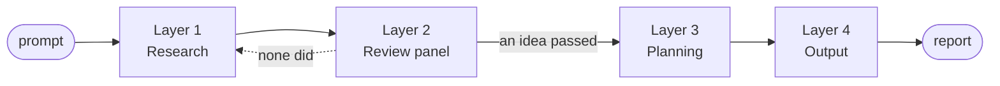
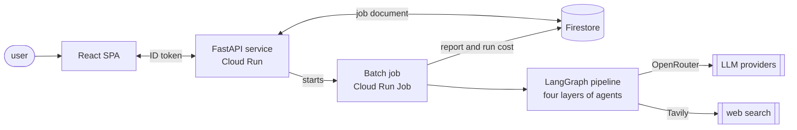

# Nexis

Nexis turns one sentence about a market into a set of researched, scored and
planned business ideas. You give it a prompt. It searches the web for openings
and invents candidates. It puts each candidate in front of a six-reviewer
panel, plans the ones that survive, attacks those plans, and writes a report.

Specialist LLM agents do that work across four layers of a
[LangGraph](https://langchain-ai.github.io/langgraph/) graph. A run needs no
human input from the prompt to the report.



| Layer | What happens |
|---|---|
| **1. Research** | A trend scanner reads HackerNews, ProductHunt and Reddit. A research agent searches the web and writes candidate ideas. A validator drops the duplicates and the ideas an incumbent already owns. |
| **2. Review panel** | Six reviewers score every idea at once: market, technical, moat, financial, risk, AI resilience. A synthesizer weights the scores and keeps the ones above a threshold. |
| **3. Planning** | An MVP architect and a GTM strategist plan each survivor together. A composer merges the two into one business plan. |
| **4. Output** | A devil's advocate attacks each plan. A generator writes the deliverable. |

When no idea clears the threshold, the graph goes back to research with the
titles it already saw listed as exclusions. After the retries run out it
force-passes the best of what it has, so a run always ends in a report.

## Quick start

You need Python 3.11+ and [uv](https://docs.astral.sh/uv/).

```bash
uv sync
cp .env.example .env      # then fill in the keys it lists
```

Run the pipeline:

```bash
uv run nexis --prompt "B2B SaaS tools for small construction companies"
```

Or from Python:

```python
from nexis import run_pipeline
from nexis.config import PipelineConfig

reports = run_pipeline(PipelineConfig(
    research_prompt="B2B SaaS tools for small construction companies",
    num_ideas=8,
    top_k=3,
))
```

To try the shape of a run cheaply, point every agent at one small model:

```bash
uv run nexis --prompt "..." --model anthropic/claude-haiku-4.5
```

Run the tests. They need no API key, because nothing under `tests/` calls a
real model:

```bash
uv run pytest tests/ -k "not live"
```

### Web UI

A FastAPI server exposes an authenticated job API and serves a React SPA.
Locally:

```bash
uv run uvicorn nexis.server:app --host 0.0.0.0 --port 8000
cd frontend && npm run dev    # Vite proxies /api, /health and /config.json to :8000
```

`GET /health` needs no token. Every `/api/*` route needs a Firebase ID token.
A job runs out of band in a Cloud Run Job and writes its result to Firestore.
The UI submits the job, then polls until it ends.

## How it is built

One Python package, three entry points: a CLI, a FastAPI service, and a batch
job. The CLI and the batch job each build the LangGraph graph and invoke it.
The service does not. It starts the batch job and returns.



| Component | Built with | Does |
|---|---|---|
| **Pipeline graph** | LangGraph `StateGraph` | Compiles one subgraph per layer, plus the supervisor, retry and force-pass nodes, and routes between them |
| **Agents** | LangChain, Pydantic v2, OpenRouter | One class per role. Each names its own model and sampling temperature, and returns a validated object |
| **Tools** | Tavily, HTTP scrapers | Web search and trend signals. Every fetched string passes one sanitizer before it reaches a prompt |
| **Scoring** | plain Python | A weighted average over the reviews. No model call, and a regression test freezes the formula |
| **API service** | FastAPI, Firebase Auth | Job endpoints behind an ID token. Also serves the built SPA |
| **Batch job** | Cloud Run Job | Runs one pipeline to the end and writes the report and the run cost to Firestore |
| **Web UI** | React 18, Vite, TypeScript | Submits a job, polls it, renders the report and the cost panel |
| **Infrastructure** | Terraform, Cloud Run, Firestore | Every resource declared in code. GitHub Actions deploys the image through Workload Identity Federation |

A run never blocks a request. The service writes a job document before it
starts the job, and the SPA polls that document until the job ends.

What holds the pipeline together:

- **Typed at every boundary.** Agents take and return Pydantic models. A bad
  answer fails validation, and the agent retries against that error rather
  than against the same prompt.
- **Nothing raises.** An agent out of retries returns a partial result with
  `failure_reason` set, so one dead call cannot end the run.
- **Width decided at run time.** Layer 1 sets the idea count, `Send()` opens a
  branch per idea and per role, and per-field reducers merge them back.
- **The ranking uses no model,** so one set of reviews always gives one
  ranking, and a frozen test catches any change to the formula.
- **Web text is data, never instruction.** It is stripped, capped and wrapped
  in markers a page cannot forge before any prompt sees it.
- **Every run prices itself.** Tokens, cost and latency, split by layer and by
  agent, stored with the job.
- **No test calls a real model.** The reviewer evals do, so they run by hand
  under a spend cap.

## Documentation

| Document | What it holds |
|---|---|
| [`docs/specification.md`](docs/specification.md) | The single source of truth: what the pipeline does and how it is built. Architecture, data contracts, scoring, configuration, observability. |
| [`docs/deployment.md`](docs/deployment.md) | How to deploy the system on Google Cloud Run with Terraform. |
| [`docs/adr/`](docs/adr/) | Architecture Decision Records. Each states the context, the alternatives and the trade-off accepted. Append-only. |
| [`CLAUDE.md`](CLAUDE.md) | Working instructions for AI agents on this codebase. |
