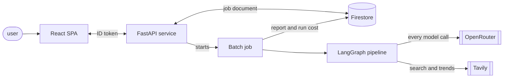

# Nexis

Nexis turns one sentence about a market into a set of researched, scored and
planned business ideas. You give it a prompt. It searches the web for openings
and invents candidates. It puts each candidate in front of a six-reviewer
panel, plans the ones that survive, attacks those plans, and writes a report.

Specialist LLM agents do that work across four layers of a
[LangGraph](https://langchain-ai.github.io/langgraph/) graph. A run needs no
human input from the prompt to the report.


| Layer | What happens |
|---|---|
| **1. Research** | A trend scanner reads HackerNews, ProductHunt and Reddit. A research agent searches the web and writes candidate ideas. A validator drops the duplicates and the ideas an incumbent already owns. |
| **2. Review panel** | Six reviewers score every idea at once: market, technical, moat, financial, risk, AI resilience. A synthesizer weights the scores and keeps the ones above a threshold. |
| **3. Planning** | An MVP architect and a GTM strategist plan each survivor together. A composer merges the two into one business plan. |
| **4. Output** | A devil's advocate attacks each plan. A generator writes the deliverable. |

When no idea clears the threshold, the graph goes back to research with the
titles it already saw listed as exclusions. After the retries run out it
force-passes the best of what it has, so a run always ends in a report.

## Quick start

You need Python 3.11+ and [uv](https://docs.astral.sh/uv/).

```bash
uv sync
cp .env.example .env      # then fill in the keys it lists
```

Run the pipeline:

```bash
uv run nexis --prompt "B2B SaaS tools for small construction companies"
```

Or from Python:

```python
from nexis import run_pipeline
from nexis.config import PipelineConfig

reports = run_pipeline(PipelineConfig(
    research_prompt="B2B SaaS tools for small construction companies",
    num_ideas=8,
    top_k=3,
))
```

To try the shape of a run cheaply, point every agent at one small model:

```bash
uv run nexis --prompt "..." --model anthropic/claude-haiku-4.5
```

Run the tests. They need no API key, because nothing under `tests/` calls a
real model:

```bash
uv run pytest tests/ -k "not live"
```

### Web UI

A FastAPI server exposes an authenticated job API and serves a React SPA.
Locally:

```bash
uv run uvicorn nexis.server:app --host 0.0.0.0 --port 8000
cd frontend && npm run dev    # Vite proxies /api, /health and /config.json to :8000
```

`GET /health` needs no token. Every `/api/*` route needs a Firebase ID token.
A job runs out of band in a Cloud Run Job and writes its result to Firestore.
The UI submits the job, then polls until it ends.

## How it is built

One Python package, three entry points: a CLI, a FastAPI service, and a batch
job. The CLI and the batch job each build the LangGraph graph and invoke it.
The service does not. It starts the batch job and returns.



| Component | Built with | Does |
|---|---|---|
| **React SPA** | React 18, Vite, TypeScript | Signs the user in, submits a job, polls it, renders the report and the cost panel |
| **FastAPI service** | FastAPI, Firebase Auth | Checks the ID token on every `/api` route, records the job, starts the batch job, serves the built SPA |
| **Firestore** | Firestore, native mode | One document per job: the config, the status, the report, the run cost |
| **Batch job** | Cloud Run Job | Runs one pipeline to the end, then writes the report and the cost back to the job document |
| **LangGraph pipeline** | LangGraph `StateGraph` | The four layer subgraphs of agents, and the nodes that retry or force-pass between them |
| **OpenRouter** | OpenRouter API | One key and one base URL in front of every model vendor |
| **Tavily** | Tavily API | The web search and the trend scan that Layer 1 reads |

A run never blocks a request. The service writes the job document before it
starts the batch job, and the SPA polls that document until the job ends.

Terraform declares every resource above. GitHub Actions builds the image and
deploys it through Workload Identity Federation, with no long-lived key.

Engineering notes:

- **Agents exchange objects, not text.** Each agent takes a Pydantic model and
  returns one, and the model schema is bound to the LLM call. An answer that
  does not fit the schema fails validation before any code reads it. The agent
  then retries with that validation error added to the conversation.
- **A failed agent returns a result, not an exception.** When its retries run
  out, it returns a valid object with `failure_reason` set. A review that
  failed is left out of the average, and the run carries on.
- **The number of parallel branches is decided at run time.** Layer 1 chooses
  how many ideas exist, so Layer 2 opens one branch per idea and per reviewer.
  Each state field declares how to merge those branches back.
- **The ranking is arithmetic, not a model call.** A weighted average of the
  review scores gives the same ranking for the same reviews every time. A test
  pins the formula to stored values.
- **Web text reaches a prompt as data, never as instruction.** Search results
  lose their control characters, get cut to a fixed length, and sit inside
  markers that a page cannot fake.
- **Each run reports its own cost.** The run stores tokens, dollars and
  latency, split by layer and by agent, and the UI shows them next to the
  report.
- **The test suite calls no model.** It runs in CI with no API key. The
  reviewer evals do call real models, so they run by hand under a spend cap.

## Documentation

| Document | What it holds |
|---|---|
| [`docs/specification.md`](docs/specification.md) | The single source of truth: what the pipeline does and how it is built. Architecture, data contracts, scoring, configuration, observability. |
| [`docs/deployment.md`](docs/deployment.md) | How to deploy the system on Google Cloud Run with Terraform. |
| [`docs/adr/`](docs/adr/) | Architecture Decision Records. Each states the context, the alternatives and the trade-off accepted. Append-only. |
| [`CLAUDE.md`](CLAUDE.md) | Working instructions for AI agents on this codebase. |
