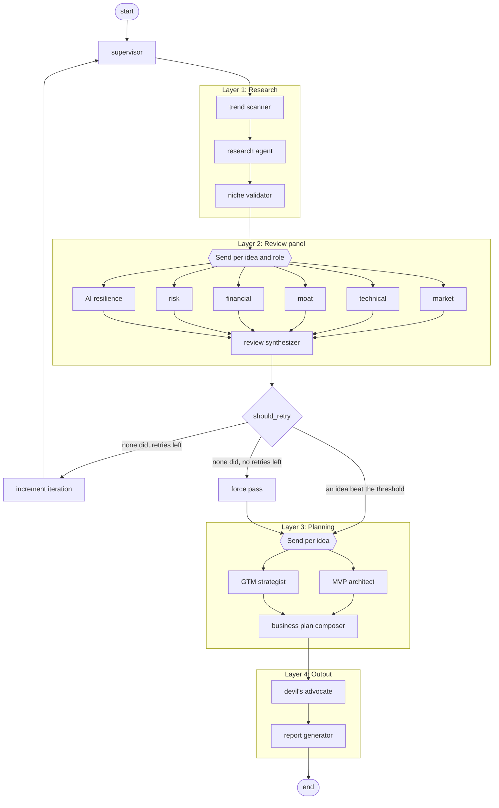

# Nexis

Autonomous multi-agent pipeline that generates, evaluates, and plans business ideas end-to-end. Orchestrated by LangGraph, runs without human intervention, and produces a structured report for the operator to review.

Thirteen LLM agents work across four layers. Each agent runs on a model chosen for its job, at a sampling temperature chosen for its job, and every call it makes lands in a per-run cost total. The review panel is measured against a labelled dataset before its scores are trusted.

## The graph



The review panel opens one branch per idea and role, so eight ideas cost forty-eight concurrent reviewer calls. The planning layer opens one branch per surviving idea, and inside each branch the MVP architect and the GTM strategist run together under `asyncio.gather()`. Two levels of parallelism and two mechanisms, because `Send()` fans out graph nodes while `gather()` fans out coroutines inside one node ([ADR-0003](docs/adr/0003-hybrid-parallelism-send-and-gather.md)).

## How it works

**Layer 1: Research.** A trend scanner runs site-scoped searches against HackerNews, ProductHunt and Reddit, and pulls trend signals out of what comes back. A research agent searches the web again for its own prompt and turns both sets of results into N candidate ideas with structured metadata. A niche validator drops duplicates and ideas an incumbent already owns.

**Layer 2: Review panel.** Six reviewers score every idea from their own angle: market, technical feasibility, competitive moat, financial viability, risk, and resilience to AI progress. A review synthesizer combines the scores with fixed weights and keeps the ideas above a threshold.

**Layer 3: Planning.** An MVP architect and a GTM strategist plan each surviving idea. A business plan composer merges the two plans into one.

**Layer 4: Output.** A devil's advocate attacks each finished plan. A report generator writes the deliverable.

The synthesizer runs no LLM. It is arithmetic over the reviewer scores, so one set of reviews always produces one ranking, and `tests/test_scoring_regression.py` freezes that formula against a stored panel ([ADR-0010](docs/adr/0010-deterministic-weighted-scoring.md)).

## Reliability

Thirteen agents and up to forty-eight concurrent reviewer calls per run mean some call fails in most runs. The pipeline treats that as normal and answers it in four separate places.

**An agent retries on its own bad output, and is told what was wrong.** `BaseAgent.invoke()` reads the validation error, appends it to the message list, and asks again. The model sees the specific failure instead of the same prompt twice.

**A timeout moves the agent to a fallback model.** After `llm_timeout` seconds the agent rebuilds its client on `config.fallback_model` and spends its remaining attempts there. The sampling temperature carries over, so a degraded run does not also become a differently calibrated one.

**A spent retry budget degrades instead of raising.** Every LLM-backed output model carries `failure_reason: str | None`. An agent that runs out of attempts returns a minimal valid instance with that field set, and every consumer checks it before use. A failed reviewer drops out of the weighted score rather than sinking the idea ([ADR-0007](docs/adr/0007-graceful-degradation-failure-reason.md)).

**A run that finds nothing good repeats the research, then gives up gracefully.** When no idea beats the threshold, `should_retry` sends the graph back to research with a prompt that names the ideas already seen and asks for others. After `max_retries` rounds it force-passes the top K by raw score. The pipeline always produces a report ([ADR-0008](docs/adr/0008-conditional-retry-force-pass-fallback.md)).

## Models

One model per agent, chosen per agent, changed in one file. `src/nexis/models.py` holds the table and cites the evidence behind every assignment, including two cautions: the benchmarks come from the vendors that sell the models, and OpenRouter prices are not always the vendor list prices ([ADR-0005](docs/adr/0005-per-agent-model-specialization.md)).

| Layer | Agent | Model | USD per Mtok, in/out |
|---|---|---|---|
| Research | Trend scanner | `google/gemini-3.7-flash` | 0.375 / 1.875 |
| Research | Research agent | `anthropic/claude-opus-5` | 5.00 / 25.00 |
| Research | Niche validator | `anthropic/claude-haiku-4.5` | 1.00 / 5.00 |
| Review | Market | `openai/gpt-5.6-terra` | 1.00 / 6.00 |
| Review | Technical | `anthropic/claude-sonnet-5` | 2.00 / 10.00 |
| Review | Moat | `anthropic/claude-sonnet-5` | 2.00 / 10.00 |
| Review | Financial | `openai/gpt-5.6-terra` | 1.00 / 6.00 |
| Review | Risk | `anthropic/claude-sonnet-5` | 2.00 / 10.00 |
| Review | AI resilience | `anthropic/claude-sonnet-5` | 2.00 / 10.00 |
| Planning | MVP architect | `anthropic/claude-opus-5` | 5.00 / 25.00 |
| Planning | GTM strategist | `openai/gpt-5.6-sol` | 5.00 / 30.00 |
| Planning | Business plan composer | `anthropic/claude-opus-5` | 5.00 / 25.00 |
| Output | Devil's advocate | `anthropic/claude-opus-5` | 5.00 / 25.00 |

Prices are OpenRouter rates read on 2026-08-14 and live in `src/nexis/pricing.py`. A vendor changes a price whenever it wants, so treat every cost this repo reports as an estimate and not a bill.

Two assignments carry a caveat worth reading before you trust their output. The risk reviewer is picked for resistance to prompt injection rather than for raw reasoning power, because it reads web text the research layer collected. The AI resilience reviewer is a Claude model that rates how exposed a business is to AI progress, so it judges its own ecosystem.

## Sampling

Temperature is a per-agent policy, not one global setting. The pipeline holds two kinds of agent and they want opposite values ([ADR-0019](docs/adr/0019-per-agent-sampling-policy.md)).

| Band | Value | Agents |
|---|---|---|
| `MEASUREMENT` | 0.0 | six reviewers, trend scanner, niche validator |
| `BALANCED` | 0.5 | MVP architect, GTM strategist, business plan composer, devil's advocate |
| `DIVERGENCE` | 1.0 | research agent |

The split does not follow the layer boundary. The research layer holds one generator and two instruments: the research agent exists to return what the last run did not, while the trend scanner lists what is on a page it was handed and the niche validator answers yes or no. A score that moves on its own cannot be compared with anything, so every reviewer sits at 0.0.

Read this as reduced variance, never as a repeatable result. A provider can still return two different answers for one input at 0.0.

`build_llm()` takes the temperature as a required argument with no default, and `PipelineConfig` refuses to start when the model table and the temperature table describe different agents. Both exist so a forgotten setting fails loudly instead of quietly taking a provider default.

## Cost accounting

Every LLM call goes through `BaseAgent`, so every call lands in the run totals. `RunMetrics` holds tokens, cost and time, split by layer and by agent, and the HTTP API returns it with the job ([ADR-0017](docs/adr/0017-per-run-cost-and-token-metrics.md)).

Two details keep the number honest. A retry pays for both attempts, so failed calls count. A model that `pricing.py` holds no price for still counts its tokens but adds no cost, and the run lists it in `unpriced_models`, which makes the reported cost a floor rather than a total.

`RunMetrics` also records the digest of the system prompt each agent sent. Two runs that report one digest for an agent ran one set of instructions, which is what makes a comparison between those runs mean anything.

## Evals

The review panel is the part of this pipeline whose output no type can check. `tests/evals/dataset.jsonl` holds 15 hand-labelled business ideas, and each label is a **score band** rather than a number, because two people who agree that an idea is commoditised still disagree on whether that is a 2 or a 3. The gate reads the band ([ADR-0018](docs/adr/0018-band-gated-reviewer-evals.md)).

These call real models and cost real money, so they never run on a pull request. Collect first, then report:

```bash
uv run python -m nexis.evals collect --out eval-run --repeats 1 --max-usd 1.00
uv run python -m nexis.evals report --run eval-run --min-hit-rate 0.7
```

`collect` refuses to start when the projected spend is above `--max-usd`. `report` reads the collected answers, calls no API, and exits non-zero when any role misses the gate, so rereading one run under different thresholds is free. It also compares the prompt digest, the model and the temperature recorded at collection time against what the code holds now, and says so when they differ. That is the case that makes an old directory read like a fresh measurement.

Run them from `.github/workflows/evals.yml`, which is `workflow_dispatch` only. Use `--repeats 5` to measure how far a reviewer moves on one idea across runs.

The labels are one person's judgement about businesses nobody built. They measure whether a reviewer agrees with that person, which is not the same as measuring whether the reviewer is right.

## Untrusted web content

The research layer reads the public web and puts what it finds into prompts. Anyone who can publish a page can therefore write into a prompt.

Web text reaches a model through `src/nexis/untrusted.py` and nowhere else. Each result loses both boundary markers and every control character, is cut to 500 characters so one hostile page cannot crowd out the others, and is wrapped between markers it cannot forge. The agent's system prompt carries a rule that names those markers and says the text between them is data to analyse and never instructions to follow ([ADR-0016](docs/adr/0016-untrusted-web-content-trust-boundary.md)).

This raises the cost of an injection. It does not close the hole, because the model still decides whether to obey the rule.

## Setup

**Requirements:** Python 3.11+, [uv](https://docs.astral.sh/uv/)

```bash
uv sync
cp .env.example .env
# Fill in the required keys — see .env.example for the full list
```

**Run tests:**

```bash
uv run pytest tests/ -k "not live"
```

That is 332 tests and no API key. One live test that calls real providers is deselected by the same filter. CI runs this command on every pull request, plus `ruff check`, `ruff format --check`, and the frontend lint, typecheck and Vitest suites.

## Usage

```python
from nexis import run_pipeline
from nexis.config import PipelineConfig

config = PipelineConfig(
    research_prompt="B2B SaaS tools for small construction companies",
    num_ideas=8,
    top_k=3,
)

reports = run_pipeline(config)
```

Or via CLI:

```bash
uv run nexis --prompt "B2B SaaS tools for small construction companies"
```

To override all agents with a single model for quick testing:

```bash
uv run nexis --prompt "..." --model anthropic/claude-haiku-4.5
```

### HTTP API and Web UI

The FastAPI server exposes an authenticated job API (`POST /api/jobs`, `GET /api/jobs`, `GET /api/jobs/{id}`) and serves the React SPA. All `/api/*` endpoints require a Firebase ID token; jobs run asynchronously in a Cloud Run Job and write results to Firestore. The detail page renders the cost and token panel from `RunMetrics` for any job that carries one. See [`docs/specification.md`](docs/specification.md) §3.6 for the full request and response shape and [`docs/deployment.md`](docs/deployment.md) for end-to-end setup.

Local dev:

```bash
uv run uvicorn nexis.server:app --host 0.0.0.0 --port 8000
cd frontend && npm run dev    # Vite proxies /api, /health, /config.json to :8000
```

Health check (unauthenticated):

```bash
curl http://localhost:8000/health
```

## Specification

[`docs/specification.md`](docs/specification.md) — Full technical specification covering architecture, data contracts, scoring formula, configuration reference, project structure, technology stack, and implementation patterns.

## Deployment

[`docs/deployment.md`](docs/deployment.md) — Infrastructure setup, CI/CD pipeline, required secrets, access control, and cost estimates.

## Architecture Decision Records

[`docs/adr/`](docs/adr/) — Nineteen records covering the orchestration framework, parallelism, scoring, the deployment model, the trust boundary for web content, cost metrics, reviewer evals, and sampling policy. Each one states the context, the alternatives considered, and the trade-off accepted.
