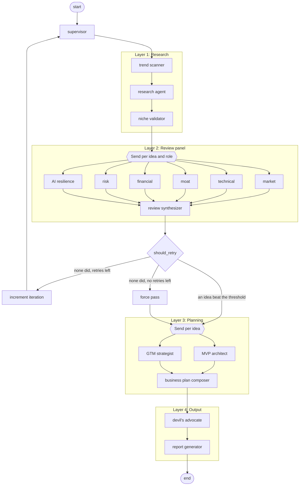

# Nexis: Technical Specification

Nexis generates business ideas, scores them, and plans the ones that survive.
Specialist LLM agents run in four layers inside one LangGraph graph. A run needs
no human input between the prompt and the report.

This document is the single source of truth for what the pipeline does and how
it is built. It does not repeat what the code already holds: model IDs live in
`src/nexis/models.py`, prices in `src/nexis/pricing.py`, and field-level
contracts in `src/nexis/state.py`. The reasons behind each design choice live
in [`adr/`](adr/). Deployment steps live in [`deployment.md`](deployment.md).

## Contents

1. [Overview](#1-overview)
2. [The pipeline](#2-the-pipeline)
3. [Data contracts](#3-data-contracts)
4. [Score and filter](#4-score-and-filter)
5. [Reviewer evals](#5-reviewer-evals)
6. [Web text in prompts](#6-web-text-in-prompts)
7. [Models and temperature](#7-models-and-temperature)
8. [Configuration](#8-configuration)
9. [Observability and failure](#9-observability-and-failure)
10. [Service and job](#10-service-and-job)
11. [Call volume per run](#11-call-volume-per-run)
12. [Technology stack](#12-technology-stack)
13. [Project structure](#13-project-structure)
14. [Extensions not built](#14-extensions-not-built)

---

## 1. Overview

### 1.1 Design goals

- **Autonomy.** The run goes from prompt to report with no human gate.
- **Parallel review.** Six reviewers score each idea at the same time.
- **Typed contracts.** Every agent input and output is a Pydantic model. Bad
  output starts a retry with the validation error attached, not a silent skip.
- **Composability.** Each layer is a subgraph you can test on its own.
- **Observability.** Every node emits a JSON event. Every run adds up its own
  tokens, cost and time, and stores the total with the job. See §9.
- **Async execution.** The user submits a job through the API. The pipeline
  runs out of band in a Cloud Run Job and writes to Firestore. See §10.
- **Marked trust boundary.** Web text enters a prompt as data between explicit
  markers, under a size cap. See §6.
- **Measured reviewers.** A labelled dataset checks the review panel, and its
  run-to-run spread is measured rather than assumed. See §5.
- **Stated temperature.** Each agent runs at a temperature the project picks,
  never at a provider default. See §7.

### 1.2 The graph



One parent `StateGraph` owns the shared `PipelineState` and routes between the
four layer subgraphs. The supervisor node seeds the state, tracks the iteration
counter, and emits a telemetry event at each transition. The retry edge runs
from the review layer back to the supervisor, so the graph holds a cycle and is
not acyclic.

---

## 2. The pipeline

### 2.1 Layer 1: Research

This layer reads the public web and returns candidate ideas.

| Agent | What it does | Output |
|---|---|---|
| **Trend Scanner** | Runs site-scoped Tavily searches against HackerNews, ProductHunt and Reddit, then pulls signals out of the results. | `list[TrendSignal]` |
| **Research Agent** | Searches the web for its own prompt and turns both result sets into `num_ideas` candidates with structured metadata. | `list[BusinessIdea]` |
| **Niche Validator** | Drops duplicates and ideas an incumbent already owns. | `list[BusinessIdea]` |

The Trend Scanner and the Research Agent are the only agents that read web
text. That text enters their prompts under the rules in §6.

### 2.2 Layer 2: Review panel

Six reviewers score every idea from their own angle. One synthesizer combines
the scores.

| Reviewer | What it judges |
|---|---|
| **market** | TAM, SAM and SOM, growth, timing, demand signals. |
| **technical** | Whether a solo developer or a small team can build the MVP in 4 to 8 weeks. Stack complexity, API dependencies, infrastructure cost. |
| **moat** | The defensibility the idea builds toward as the business matures, not the defensibility it holds before launch. Credits operational data, a qualification the business must buy, integration depth, and a maintained domain model. Named anchors set the scale. Flags commodity risk. |
| **financial** | Unit economics: CAC, LTV, margin structure, path to ramen profitability. |
| **risk** | Regulation, single points of failure, ethics, market timing. |
| **ai_resilience** | Exposure to AI progress: whether a foundation-model provider can replicate the core value, whether the idea builds on AI or competes with it, and how fast the frontier moves in the domain. |

Each reviewer returns one `Review` with a score from 1 to 10, a rationale, red
flags and a confidence. The **Review Synthesizer** is the fan-in node. It runs
no LLM: it applies the weighted formula of §4, ranks the ideas, drops the ones
below the threshold, and passes the top K to Layer 3.

### 2.3 Layer 3: Planning

Every surviving idea gets a plan.

| Agent | What it does | Output |
|---|---|---|
| **MVP Architect** | Picks core features under MoSCoW, recommends a stack, sketches the data model, writes a 4 to 8 week sprint plan, estimates the build cost. | `MVPPlan` |
| **GTM Strategist** | Names the ICP, the positioning, the ranked channels, the pricing model, the launch sequence and the first 100 customers playbook. | `GTMPlan` |
| **Business Plan Composer** | Merges the two plans and adds an executive summary, the key assumptions and the success metrics. | `BusinessPlan` |

### 2.4 Layer 4: Output

| Agent | What it does | Output |
|---|---|---|
| **Devil's Advocate** | Attacks each finished plan and rates how well it survives. | `Rebuttal` |
| **Report Generator** | Renders the deliverable from Jinja2 templates: idea cards, scores, plans and rebuttals. | `Report` |

### 2.5 Retry and force pass

After the synthesizer runs, `should_retry` returns one of three routes:

| Route | Condition | Effect |
|---|---|---|
| `planning` | `top_ideas` is not empty. | Go to Layer 3. |
| `retry` | `top_ideas` is empty and `iteration < max_retries`. | Increment the iteration, return to the supervisor, and rerun Layer 1 with a refined prompt that lists the titles already seen as exclusions. |
| `force_pass` | `top_ideas` is empty and no retries are left. | Take the top `top_k` ideas by raw score, ignore the threshold, go to Layer 3. |

Each idea carries the `iteration` that produced it, so the review layer only
fans out over ideas from the current iteration. The pipeline always reaches a
report. See ADR-0008.

### 2.6 Parallelism

Two mechanisms, because the pipeline fans out for two different reasons.
`Send()` fans out graph nodes, and it handles a branch count that only Layer 1
decides. `asyncio.gather()` fans out coroutines inside one node, and it handles
a fixed set of calls that node needs before it continues. See ADR-0003.

- **Layer 2** emits one `Send()` per idea and role, so eight ideas open 48
  concurrent reviewer calls. LangGraph counts the tasks and fans in at the
  synthesizer on its own.
- **Layer 3** emits one `Send()` per surviving idea. Inside each node the MVP
  Architect and the GTM Strategist run under one `asyncio.gather()`. Both calls
  stay in a single node, which avoids write conflicts between graph branches.

**One branch must never sink the others.** Every `asyncio.gather()` in the
pipeline follows this rule in one of two ways. Either the coroutine catches its
own errors, as `TrendScraperTool` does per source, or the `gather()` passes
`return_exceptions=True` and the caller handles each branch. Layer 3 turns a
raised branch into the same partial result the agent builds for itself when it
runs out of retries (§9.3). An agent whose schema has no minimal value cannot
build that result; Layer 3 then drops that one idea and Layer 4 reports on the
rest.

---

## 3. Data contracts

Every agent input and output is a Pydantic model. The shared graph state is a
`TypedDict` that holds those models. `src/nexis/state.py` is the definition;
the tables below state the shape and the invariants, not the field list.

### 3.1 Pipeline state

| Field | Written by | Holds |
|---|---|---|
| `config` | Invocation | The `PipelineConfig` of §8.1 |
| `research_prompt` | Supervisor | The current prompt, refined on each retry |
| `iteration` | Supervisor | The retry counter, capped at `max_retries` |
| `ideas` | Layer 1 | Candidate ideas, accumulated with `operator.add` |
| `reviews` | Layer 2 | Every reviewer answer, accumulated with `operator.add` |
| `scores` | Layer 2 | Weighted score per idea, 0.0 to 1.0 |
| `top_ideas` | Layer 2 | IDs of the ideas that passed the filter |
| `mvp_plans`, `gtm_plans`, `business_plans` | Layer 3 | One plan per surviving idea, keyed by idea ID |
| `rebuttals` | Layer 4 | One rebuttal per plan, keyed by idea ID |
| `final_reports` | Layer 4 | The deliverable documents |

List fields use `operator.add` and dict fields use a merge reducer, so parallel
branches write into the same state without a conflict. See ADR-0006.

### 3.2 Models

| Model | Produced by | Carries |
|---|---|---|
| `TrendSignal` | Trend Scanner | One observed signal, with its source |
| `BusinessIdea` | Research Agent | Title, problem, target market, revenue model, TAM estimate, confidence, sources, trend signals, iteration |
| `Review` | One reviewer | Idea ID, role, score 1 to 10, rationale, red flags, confidence |
| `MVPPlan` | MVP Architect | Features, stack, data model, sprint plan, cost estimate, complexity |
| `GTMPlan` | GTM Strategist | ICP, positioning, channels, pricing, launch sequence, playbook |
| `BusinessPlan` | Composer | Summary, assumptions, metrics, and both plans embedded |
| `Rebuttal` | Devil's Advocate | Challenges, severity, mitigations, survivability |
| `Report` | Report Generator | The rendered deliverable |

Three invariants hold across all of them:

- **Every LLM-backed model carries `failure_reason: str | None`.** An agent
  that runs out of attempts returns a minimal valid instance with that field
  set. Every consumer checks it before use. See ADR-0007.
- **Every score is an integer from 1 to 10, and every confidence is a float
  from 0.0 to 1.0.** The model enforces both bounds, not the prompt.
- **Every plan and review references its idea by `idea_id`.** Nothing embeds a
  copy of the idea.

**Schema depth.** Some providers reject deeply nested JSON schemas. The
composer therefore asks for a flat `BusinessPlanSynthesis` that holds only the
fields it writes, and builds the full `BusinessPlan` in application code. This
keeps the nested tree out of the grammar compiler.

---

## 4. Score and filter

### 4.1 Weights

The synthesizer weights the six reviewers. The defaults are configurable.

| Reviewer | Weight | Why |
|---|---|---|
| market | 0.25 | Market size and timing predict success better than anything else here. |
| technical | 0.20 | A solo team is the constraint. An infeasible idea wastes every later call. |
| financial | 0.20 | Unit economics must be plausible even at the idea stage. |
| moat | 0.15 | Defensibility drives long-term value. Lowered from 0.20 once commodity risk got its own reviewer. |
| risk | 0.10 | Risk modifies the answer, it does not drive it. Lowered from 0.15 for the same reason. |
| ai_resilience | 0.10 | Real but not dominant. Penalizes ideas that AI progress can commoditize. |

### 4.2 Formula

```
score = Σ (weight_i × reviewer_score_i × reviewer_confidence_i) / 10
```

The result falls in 0.0 to 1.0. The confidence multiplier stops one uncertain
reviewer from sinking an idea. The formula runs no LLM, so one set of reviews
always gives one ranking. `tests/test_scoring_regression.py` freezes it against
a stored panel. Change the weights or the formula and update the frozen values
in the same commit. See ADR-0010.

### 4.3 Threshold

An idea below `score_threshold` (default 0.55) is dropped. The top `top_k`
(default 3) go to Layer 3. Fewer than K passing means all of them go.

---

## 5. Reviewer evals

§4 treats a reviewer score as a measurement. Two evals check that assumption.
Both run from `src/nexis/evals`. See ADR-0018.

**Calibration** asks whether a reviewer agrees with a human.
`tests/evals/dataset.jsonl` holds frozen `BusinessIdea` objects. Each one
carries the score band that one or more roles are expected to land in, and the
written reasoning behind the band. A score inside its band is correct, and the
error is the distance to the nearest edge, which is zero inside. Each role must
reach a minimum share of in-band scores; the default is 70%. A labelled role
that scored nothing fails the gate too. An outage that drops every call from
one reviewer must not read as a passing run.

**A label is a band, never a single value.** A human can say that an obviously
commoditised idea must not score 8 for moat. That same human cannot say whether
it is a 2 or a 3. A role carries a band only where the label writer holds a
firm opinion. An unlabelled pair is still reviewed, but it does not gate.

**Variance** asks whether a reviewer agrees with itself. The same ideas run N
times and the report gives the standard deviation per role. This needs at least
two repeats. One repeat gives an empty variance report rather than a zero.

**Collection is separate from analysis.** `collect` calls the models and
appends each answer to `reviews.jsonl` as it arrives. `report` reads that
directory, calls no API, and exits non-zero when a role misses the gate. So a
new band or a new threshold costs nothing, and an interrupted run keeps the
answers it paid for. A manifest is written before the first call, so a run that
dies halfway stays analysable.

**A stale run is named, not failed.** `report` compares the prompt digest, the
model and the temperature recorded at collection time against what the code
holds now. It names any role that no longer matches. An answer is evidence
about what produced it and about nothing else. The note explains the numbers
rather than judges them, so it leaves the exit code alone. A manifest written
before the temperature field existed records none and makes no claim, so the
check skips it.

**An eval never runs Layer 1.** The ideas are frozen. That holds every variable
except the reviewer, and keeps the search API out of the loop.

**Spending is capped in code.** The collector projects the cost from the price
table and refuses to start above a limit passed on the command line. A model
with no price stops the projection instead of counting as free. The manifest
stores the projected cost, the measured cost and the tokens the run really
used, so the projection is corrected from a measurement. A reasoning model
bills thinking tokens that never reach the answer, so a projection sized from
visible text alone under-protects.

### 5.1 How to run them

Collect first, then report:

```bash
uv run python -m nexis.evals collect --out eval-run --repeats 1 --max-usd 1.00
uv run python -m nexis.evals report  --run eval-run --min-hit-rate 0.7
```

Use `--repeats 5` to measure variance. Use `collect --model` to point every
role at one cheap model while you debug the harness, and never publish numbers
from a run that used one: those answers measure the stand-in, not the panel.

The evals cost money, so `.github/workflows/evals.yml` is `workflow_dispatch`
only and never fires on a push or a pull request. The formula of §4.2 needs no
LLM and is frozen separately, in a regression test that runs in ordinary CI.

### 5.2 What the numbers do not say

The labels are one person's judgement about businesses nobody built. They
measure whether a reviewer agrees with that person, which is not the same as
measuring whether the reviewer is right.

---

## 6. Web text in prompts

Text a tool fetched from the web is untrusted data. Text an agent produced is
pipeline data. That is the trust boundary. See ADR-0016.

Web text reaches a model through `src/nexis/untrusted.py` and nowhere else:

- **Marked.** The text sits between `<<<UNTRUSTED_WEB_CONTENT>>>` and
  `<<<END_UNTRUSTED_WEB_CONTENT>>>`, never merged into the instructions around
  it.
- **Cleaned.** Both markers and every control character are stripped from the
  text, so a page cannot forge a marker and close the block early.
- **Capped.** Each result is cut to `MAX_UNTRUSTED_CHARS` (500) and the cut is
  noted in the text, so one hostile page cannot crowd out the others.
  `max_results` caps how many results arrive; this caps their size.
- **Governed.** The agent's system prompt carries `UNTRUSTED_DATA_RULE`. That
  paragraph names both markers. It states that the text between them is data to
  analyse and never instructions to follow.

`TrendScraperTool` applies the same cap to `TrendSignal.signal`, because
Firestore stores that string and the report renders it.

The rule is a convention, not a control. A model can still obey text inside the
block. The boundary raises the cost of an injection and states the contract. It
does not prove the model honours it.

---

## 7. Models and temperature

**One model per agent.** `src/nexis/models.py` holds the table and cites the
evidence behind every assignment. It is the only place to change one. All calls
route through OpenRouter (ADR-0004), so an assignment is an OpenRouter model
ID. See ADR-0005.

Two assignments carry a caveat. The risk reviewer is picked for resistance to
prompt injection rather than for raw reasoning power, because it reads web text
the research layer collected. The AI resilience reviewer is a Claude model that
rates how exposed a business is to AI progress, so it judges its own ecosystem.

**One temperature per agent.** The pipeline holds two kinds of agent and they
take opposite settings. An agent that judges is an instrument and must not move
on its own. An agent that invents exists to return what the last run did not.
`src/nexis/sampling.py` holds the bands. See ADR-0019.

| Band | Value | Agents |
|---|---|---|
| `MEASUREMENT` | 0.0 | the six reviewers, Trend Scanner, Niche Validator |
| `BALANCED` | 0.5 | MVP Architect, GTM Strategist, Business Plan Composer, Devil's Advocate |
| `DIVERGENCE` | 1.0 | Research Agent |

The split does not follow the layer boundary. Layer 1 holds both kinds: the
Research Agent invents ideas, while the Trend Scanner lists signals in pages it
is handed and the Niche Validator answers yes or no.

Three rules keep a forgotten setting loud. `build_llm()` and every agent
constructor take `temperature` with no default, so an agent whose author never
picked a value fails to construct. `PipelineConfig` refuses to build when the
model table and the temperature table describe different agents.
`_switch_to_fallback()` carries the temperature to the fallback client, so a
timeout cannot re-sample a reviewer at a different setting. `None` means "send
no temperature", which is how to handle a model that rejects the parameter.

A lower temperature narrows the spread. It does not remove it. Read these
settings as reduced variance, never as a repeatable result.

---

## 8. Configuration

### 8.1 PipelineConfig

One Pydantic model, passed at invocation, controls the pipeline.

| Parameter | Type | Default | Purpose |
|---|---|---|---|
| `research_prompt` | `str` | *(required)* | The seed prompt for idea generation |
| `num_ideas` | `int` | `8` | Candidates Layer 1 generates |
| `top_k` | `int` | `3` | Ideas Layer 2 passes to Layer 3 |
| `score_threshold` | `float` | `0.55` | Minimum weighted score to pass Layer 2 |
| `max_retries` | `int` | `2` | Retry loops when no idea passes |
| `reviewer_weights` | `dict` | See §4.1 | Weights for the score formula |
| `agent_models` | `dict[str, str]` | `nexis/models.py` | Agent key to OpenRouter model ID |
| `agent_temperatures` | `dict[str, float \| None]` | `nexis/sampling.py` | Agent key to temperature. Must cover exactly the keys of `agent_models`. See §7 |
| `output_format` | `str` | `markdown` | `markdown` or `json` |
| `llm_timeout` | `int` | `300` | Seconds per LLM call, enforced with `asyncio.wait_for` |
| `fallback_model` | `str` | `google/gemini-3.7-flash` | Model used after a timeout |

### 8.2 Environment variables

Cloud Run takes non-secret values from Terraform and API keys from Secret
Manager. Locally, put the required entries in `.env`. `.env.example` lists the
required set and nothing else.

**Required.** Both the Cloud Run Service and the Cloud Run Job need all five.

| Variable | Read in | Purpose |
|---|---|---|
| `OPENROUTER_API_KEY` | `agents/base.py` | Key for every LLM call |
| `TAVILY_API_KEY` | Tavily SDK | Key for web search |
| `GCP_PROJECT_ID` | `auth.py`, `firestore.py`, `job_trigger.py` | GCP project. The Admin SDK and `/config.json` reuse it as the Firebase project ID |
| `GCP_REGION` | `job_trigger.py` | Region of the Cloud Run Job |
| `FIREBASE_API_KEY` | `server.py` | Firebase Web SDK `apiKey`, served to the SPA. Safe to expose: the backend enforces auth by checking the ID token |

**Optional.**

| Variable | Default | Purpose |
|---|---|---|
| `FIREBASE_AUTH_DOMAIN` | `<GCP_PROJECT_ID>.firebaseapp.com` | Override only for a custom auth domain |
| `LANGCHAIN_TRACING_V2` | `false` | Turn on LangSmith tracing |
| `LANGCHAIN_API_KEY` | *(unset)* | Needed only when tracing is on |
| `LANGCHAIN_PROJECT` | `nexis` | LangSmith project name |

**Per-job overrides.** `trigger_job_execution()` sets these on the Cloud Run
Job from the `JobConfig` submitted to `POST /api/jobs`. No operator sets them.

| Variable | Source |
|---|---|
| `JOB_ID` | The Firestore document ID the Service wrote |
| `RESEARCH_PROMPT`, `NUM_IDEAS`, `TOP_K`, `SCORE_THRESHOLD`, `OUTPUT_FORMAT` | The matching `JobConfig` fields |

**Frontend.** The SPA has no build-time variables. At startup it fetches
`/config.json` and gets `{apiKey, authDomain, projectId}` composed from the
backend variables above, so no Firebase value is baked into the bundle.

Do **not** set `FIREBASE_PROJECT_ID`. The Admin SDK reads `GCP_PROJECT_ID`, and
`/config.json` reuses it. The Cloud Run Job name (`nexis-job`) is fixed in
`job_trigger.py` and in Terraform. It is not configurable per deployment.

---

## 9. Observability and failure

### 9.1 Telemetry

Every node emits a JSON event through the `nexis.telemetry` logger: node name,
layer ID, latency, the state keys in and out, and any error. An LLM call event
adds the agent, the model, the token counts, the estimated cost, the prompt
version, the attempt number and the outcome. A null cost means no price is
known for that model, not a free call. Every event of a run carries the same
`run_id`, and each run closes with one `run_complete` event holding the totals
of §9.2. With `LANGCHAIN_TRACING_V2=true`, LangChain forwards the traces to
LangSmith. See ADR-0009.

### 9.2 Run metrics

`RunMetrics` (`src/nexis/metrics.py`) counts calls, input and output tokens,
estimated cost and LLM seconds, in three views: run totals, per layer, and per
agent. It also holds the wall time, the prompt version of each agent, and the
models it could not price. See ADR-0017.

| Property | Rule |
|---|---|
| **Scoped** | One `RunMetrics` per run, held in a context variable. asyncio copies the context into every task, so a fan-out adds to the run that started it and never to another run in the same process. |
| **Attributed** | `instrument_node()` publishes the layer it wraps, so a call several frames below the node lands in the right layer. A call outside any node lands in `unattributed`. |
| **Complete** | A call that failed validation still counts, because the retry pays for both attempts. The metrics answer what a run cost, not what it bought. |
| **Honest** | Cost comes from a dated price table in `src/nexis/pricing.py`, so it is an estimate. A model missing from the table is named in `unpriced_models` and its tokens still count, which makes the reported cost a floor. |
| **Persistent** | The Cloud Run Job writes the totals to `JobRecord.metrics` for a failed run as well as a completed one, and the SPA renders them beside the report. |

`llm_seconds` sums over calls and exceeds `wall_seconds` whenever a layer fans
out. The two are reported separately: the ratio shows what concurrency saved.

The prompt version is the first 12 hex characters of the SHA-256 digest of an
agent's system prompt. Two runs that report one digest for an agent ran one set
of instructions, which is what makes a comparison between them mean anything.

### 9.3 Failure handling

A run makes tens of model calls, many of them at the same time, so some call
fails in most runs. The pipeline answers that in six separate places.

| Failure | Response |
|---|---|
| **Bad LLM output** | `BaseAgent.invoke()` appends the validation error to the message list and asks again, up to 2 retries. The model sees the specific failure instead of the same prompt twice. |
| **Timeout** | After `llm_timeout` seconds the agent rebuilds its client on `fallback_model` and spends its remaining attempts there, at the same temperature. A degraded run does not also become a differently calibrated one. |
| **Spent retry budget** | The agent returns a minimal valid instance with `failure_reason` set. A failed reviewer drops out of the weighted score rather than sinking the idea. |
| **Tool failure** | One immediate attempt, then backoff at 1s, 4s and 16s. The agent then proceeds with the data it has and logs a warning. |
| **No idea passes** | `should_retry` reruns the research, then force-passes. See §2.5. |
| **Job trigger failure** | The Service marks the job `failed` and returns 503. The stored `error` and the response body both carry one fixed message. The exception detail stays in the log. |

---

## 10. Service and job

A small web surface lets authenticated users submit jobs and read results. See
ADR-0013, ADR-0014 and ADR-0015.

| Part | File | Responsibility |
|---|---|---|
| **FastAPI Service** | `server.py` | `POST /api/jobs`, `GET /api/jobs`, `GET /api/jobs/{id}`, plus `GET /health` and `GET /config.json`. Serves the built SPA from `frontend/dist/`. Every `/api/*` route needs a Firebase ID token; `/health` and `/config.json` do not |
| **Auth** | `auth.py` | Verifies the ID token with the Firebase Admin SDK |
| **Firestore** | `firestore.py` | `JobRecord` CRUD on the `jobs/` collection: `id`, `user_id`, `status`, `config`, timestamps, `error`, `result`, `metrics` |
| **Job trigger** | `job_trigger.py` | Issues a `run_v2.RunJobRequest` with the per-job overrides of §8.2. The returned operation is deliberately not awaited; progress shows up as Firestore status changes |
| **Cloud Run Job** | `job_runner.py` | Runs as `python -m nexis.job_runner`. Reads `JOB_ID` and the overrides, builds the graph, invokes it, and writes the reports or an error. It writes the run metrics either way and uses `JOB_ID` as the run ID |
| **React SPA** | `frontend/` | Login, dashboard and job detail. Fetches `/config.json` at startup, authenticates against Firebase, polls `/api/jobs*` while a job is `pending` or `running`, and renders the report and the cost panel |

**Checkpointer.** The CLI and the Job build the graph with `InMemorySaver`.
State lives in memory for one run and does not survive it. That fits an
execution model where each job runs to completion in its own container. The
Service builds a graph with no checkpointer at import, and never invokes it.
That object exists so `langgraph dev` can export the graph.

---

## 11. Call volume per run

Cost follows the call count, and the call count follows the pipeline shape and
the `num_ideas` and `top_k` settings. It holds whatever models are assigned.

With 8 candidates and 3 survivors:

| Layer | LLM calls |
|---|---|
| 1: Research | 3 |
| 2: Review | 8 × 6 + 1 = 49 |
| 3: Planning | 3 × 3 = 9 |
| 4: Output | 3 + 1 = 4 |
| **Total** | **~65** |

Retries add to this. A failed validation re-invokes the agent, and a Layer 2
retry reruns Layers 1 and 2 for the new ideas. An eval run has a different
shape: ideas × 6 roles × repeats, with Layer 1 never starting. A dataset of 15 ideas
therefore costs 90 calls per repeat.

This document does not price these calls. The price per call depends on the
assigned model and its current OpenRouter rate, and both change without a
commit to this repository. Every run reports its own cost (§9.2), which is the
number to trust over any figure written anywhere. Tavily search is billed
separately and is not in that total.

---

## 12. Technology stack

| Component | Technology |
|---|---|
| Orchestration | LangGraph 1.1+ (StateGraph, Send, subgraphs, checkpointing) |
| LLM gateway | OpenRouter, `openrouter.ai/api/v1` |
| Structured output | LangChain `with_structured_output()` with Pydantic v2 |
| Web search | Tavily Search API |
| Checkpointer | InMemorySaver, in memory, one run |
| Tracing | `nexis.telemetry` JSON logs; LangSmith when enabled |
| Runtime | Python 3.11+, asyncio |
| Packages | uv |
| Report | Jinja2 templates, markdown or JSON |
| Web UI | React 18, Vite 5, TypeScript, served by the FastAPI container |
| Auth | Firebase Auth, email and password. Admin SDK server side, Web SDK client side |
| Job state | Firestore native mode, `jobs/` collection, composite index on (`user_id`, `created_at desc`) |
| Infrastructure | Terraform with a GCS state backend |
| Hosting | Cloud Run Service (API and SPA) and Cloud Run Job (pipeline). Open at the platform level, Firebase Auth enforced by the app. See [deployment.md](deployment.md) |

---

## 13. Project structure

```
nexis/
├── docs/
│   ├── specification.md    # This document
│   ├── deployment.md       # How to deploy
│   └── adr/                # Architecture Decision Records
├── infrastructure/
│   └── terraform/          # GCP resources (ADR-0012)
├── .github/workflows/      # CI, deploy, and the manual eval workflow
├── src/nexis/
│   ├── layers/             # The four LangGraph subgraphs
│   ├── agents/             # Per-agent LLM wrappers and BaseAgent
│   ├── tools/              # Tavily search and trend scraping
│   ├── evals/              # Reviewer calibration and variance (ADR-0018)
│   └── templates/          # Jinja2 report templates
├── frontend/               # React and Vite SPA (ADR-0015)
│   └── src/
│       ├── api/            # HTTP client and typed job calls
│       ├── auth/           # Firebase Web SDK, auth context and hooks
│       ├── components/     # Layout, routes, job cards, forms, report viewer
│       ├── pages/          # Login, dashboard, job detail
│       ├── lib/            # Polling hook and formatting helpers
│       └── test/           # Vitest setup
└── tests/
    ├── test_agents/        # Per-agent unit tests, mocked LLM
    ├── test_layers/        # Per-layer subgraph tests
    ├── test_tools/         # Search and trend tool tests
    ├── test_evals/         # Eval harness tests, stand-in reviewer
    └── evals/              # Frozen data: labelled dataset, scoring fixture
```

---

## 14. Extensions not built

These are candidates, not commitments.

- **Memory across runs.** Keep idea history in a vector store, so a later run
  can avoid what an earlier one already produced.
- **Domain adapters.** Pluggable prompt and criteria sets per vertical, such as
  SaaS, marketplace, developer tools or Web3.
- **Competitive intelligence layer.** An agent between Layers 1 and 2 that
  enriches each idea with funding data, app store rankings and SEO data.
- **Automated validation.** After Layer 4, generate a landing page and post to
  relevant communities to test demand before any code is written.
- **A2A protocol.** Expose each layer as an A2A agent, so an external system
  can invoke one layer or swap in another implementation.
- **Real data behind the reviewers.** Market data APIs for market, Crunchbase
  for moat, regulatory databases for risk, Google Trends for the Niche
  Validator. Add X as a fourth trend source.
- **Push instead of poll.** Replace the SPA poll loop with a Firestore listener
  or a push endpoint. The dashboard would then update the moment a job ends.
